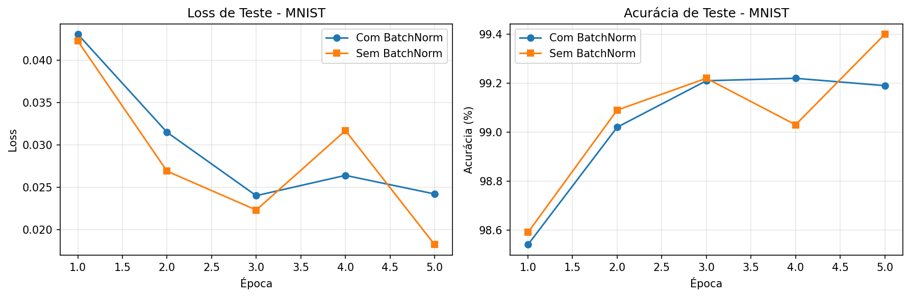
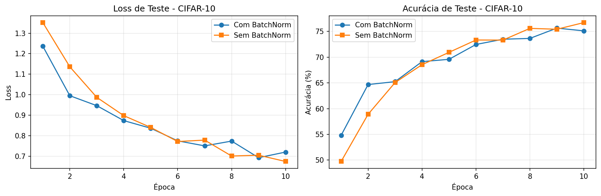
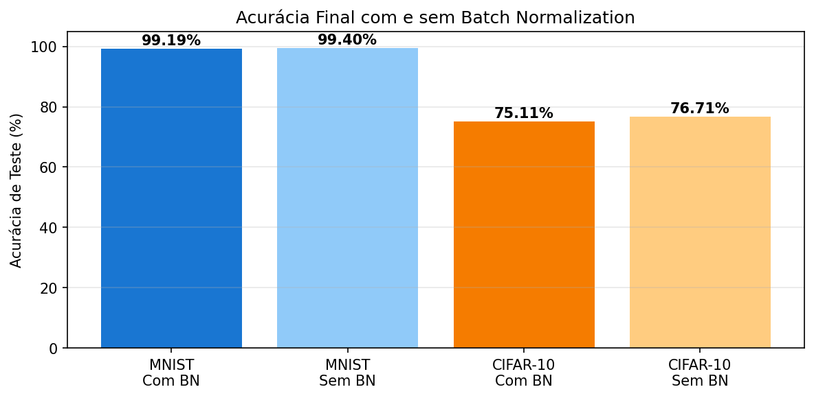

# Estudo de Ablação da LightCNN

**Disciplina:** Introdução à Aprendizagem Profunda  
**Atividade:** Estudo de Ablação  
**Modelo base:** LightCNN da APS anterior  
**Componente avaliado:** Batch Normalization  
**Framework:** PyTorch 2.11.0 + CUDA  
**GPU:** NVIDIA GeForce RTX 4050 Laptop GPU

---

## 1. Objetivo

Este estudo avalia o impacto da **Batch Normalization** na CNN customizada LightCNN. Para isso, foram treinadas duas versões do mesmo modelo:

- **LightCNN com BatchNorm:** arquitetura original usada na APS anterior.
- **LightCNN sem BatchNorm:** mesma arquitetura, mas sem as camadas `BatchNorm2d`.

Foram usados os mesmos datasets da APS anterior: **MNIST** e **CIFAR-10**.

---

## 2. Metodologia

A arquitetura base possui três blocos convolucionais seguidos por um classificador:

```text
Conv2d -> BatchNorm opcional -> ReLU -> MaxPool
Conv2d -> BatchNorm opcional -> ReLU -> MaxPool
Conv2d -> BatchNorm opcional -> ReLU -> MaxPool
Flatten -> Linear(256) -> ReLU -> Dropout(0.5) -> Linear(10)
```

Configuração experimental:

| Dataset | Épocas | Batch size | Otimizador | Learning rate |
|---|---:|---:|---|---:|
| MNIST | 5 | 128 | Adam | 0,001 |
| CIFAR-10 | 10 | 128 | Adam | 0,001 |

As métricas avaliadas foram **loss de teste**, **acurácia de teste** e **tempo de treinamento**.

---

## 3. Resultados

### 3.1 MNIST

| Variante | Parâmetros | Loss teste | Acurácia teste | Tempo |
|---|---:|---:|---:|---:|
| Com BatchNorm | 390.858 | 0,0242 | 99,19% | 241,5s |
| Sem BatchNorm | 390.410 | 0,0182 | **99,40%** | 368,0s |



No MNIST, a remoção da BatchNorm não prejudicou o desempenho. A versão sem BatchNorm alcançou acurácia ligeiramente maior, embora tenha levado mais tempo para treinar. Como o MNIST é um dataset simples, com imagens pequenas e em escala de cinza, a CNN consegue aprender bem mesmo sem normalização intermediária.

### 3.2 CIFAR-10

| Variante | Parâmetros | Loss teste | Acurácia teste | Tempo |
|---|---:|---:|---:|---:|
| Com BatchNorm | 620.810 | 0,7199 | 75,11% | 272,8s |
| Sem BatchNorm | 620.362 | 0,6740 | **76,71%** | 181,4s |



No CIFAR-10, a versão sem BatchNorm também terminou com acurácia maior no recorte curto de 10 épocas. Isso indica que, nesta configuração específica, a BatchNorm não foi determinante para melhorar o desempenho final. Ainda assim, a curva com BatchNorm apresenta ganho rápido nas primeiras épocas, sugerindo algum efeito de estabilização inicial.

### 3.3 Comparação Final



| Dataset | Melhor variante | Diferença de acurácia |
|---|---|---:|
| MNIST | Sem BatchNorm | +0,21 ponto percentual |
| CIFAR-10 | Sem BatchNorm | +1,60 ponto percentual |

---

## 4. Discussão

O componente escolhido para a ablação foi a **Batch Normalization**, por ser uma parte recorrente da LightCNN original e uma técnica comum para estabilizar o treinamento de redes convolucionais.

Neste experimento enxuto, a remoção da BatchNorm **não causou degradação de desempenho**. Pelo contrário, a versão sem BatchNorm obteve resultados ligeiramente melhores nos dois datasets. A diferença foi pequena no MNIST e mais perceptível no CIFAR-10.

Uma explicação possível é que a LightCNN é relativamente pequena, usa Adam como otimizador e ainda mantém Dropout no classificador. Além disso, o número de épocas foi reduzido para manter a atividade leve. Em treinamentos mais longos ou redes mais profundas, a BatchNorm poderia ter um impacto diferente, principalmente na estabilidade e velocidade de convergência.

Também é importante observar que os resultados podem variar por inicialização aleatória, ordem dos batches e data augmentation. Como o estudo foi propositalmente menor, ele mostra o impacto prático neste cenário específico, mas não elimina a utilidade geral da BatchNorm em arquiteturas maiores.

---

## 5. Conclusão

A ablação mostrou que a **Batch Normalization não foi essencial** para a LightCNN neste experimento reduzido. A versão sem BatchNorm manteve, e até superou levemente, o desempenho da versão original:

- MNIST: 99,40% sem BatchNorm contra 99,19% com BatchNorm.
- CIFAR-10: 76,71% sem BatchNorm contra 75,11% com BatchNorm.

Minha opinião é que, para esta CNN pequena e para este número reduzido de épocas, a BatchNorm não trouxe benefício claro. Porém, ela ainda pode ser útil em experimentos mais longos, redes mais profundas ou configurações de treinamento mais instáveis.

Assim, a principal conclusão prática é que a LightCNN pode ser simplificada removendo a BatchNorm sem perda de desempenho neste cenário, reduzindo levemente o número de parâmetros e mantendo boa capacidade preditiva.
